# E-commerce Customer Analytics & Churn Prediction


## Project Overview

An **end-to-end Data Science project** that analyzes Brazilian e-commerce data to predict customer churn and provide actionable business insights.

The project covers the complete data science lifecycle:

**Business Problem → Data Understanding → Cleaning → EDA → Feature Engineering → Model Building → Evaluation → Business Insights → Deployment**

### The Problem

An e-commerce company has a **repeat purchase rate of only ~15%** — 85% of customers never return after their first purchase. The business needs to:

1. **Identify** which customers are likely to churn
2. **Understand** why customers stop buying
3. **Prioritize** retention campaigns based on churn risk
4. **Quantify** the revenue impact of customer churn

### The Solution

- Engineered **12 customer-level features** from 8 relational tables (~18,000 orders)
- Compared **5 ML models** — XGBoost achieved the best ROC-AUC (~0.88)
- Built an **interactive Streamlit dashboard** with real-time churn prediction
- Identified **top churn drivers**: recency, purchase frequency, and late deliveries

## ML Workflow

```mermaid
graph LR
    A[8 CSV Files] --> B[Data Cleaning]
    B --> C[EDA & Visualization]
    C --> D[Feature Engineering]
    D --> E[12 Customer Features]
    E --> F[Model Comparison]
    F --> G[XGBoost - Best Model]
    G --> H[Hyperparameter Tuning]
    H --> I[Business Insights]
    I --> J[Streamlit Dashboard]
```



## Key Results

| Metric | Value |
|--------|-------|
| **Best Model** | XGBoost |
| **ROC-AUC** | ~0.88 |
| **Top Feature** | `recency_days` (days since last purchase) |
| **Churn Rate** | ~60-70% (90-day threshold) |
| **Models Compared** | 5 (LR, DT, RF, XGBoost, LightGBM) |
| **Features Engineered** | 12 |

## Project Structure

```
├── README.md                          # This file
├── requirements.txt                   # Python dependencies
├── setup.py                           # One-command data setup
├── app.py                             # Streamlit dashboard
│
├── data/                              # Raw CSV datasets
│   ├── olist_customers_dataset.csv
│   ├── olist_orders_dataset.csv
│   ├── olist_order_items_dataset.csv
│   ├── olist_order_payments_dataset.csv
│   ├── olist_order_reviews_dataset.csv
│   ├── olist_products_dataset.csv
│   ├── olist_sellers_dataset.csv
│   └── product_category_name_translation.csv
│
├── notebooks/                         # Jupyter notebooks (the DS pipeline)
│   ├── 01_data_understanding.ipynb    # Load & explore the dataset
│   ├── 02_data_cleaning.ipynb         # Missing values, outliers, types
│   ├── 03_eda.ipynb                   # 15+ visualizations & insights
│   ├── 04_feature_engineering.ipynb   # 12 customer-level features
│   ├── 05_model_building.ipynb        # 5-model comparison & tuning
│   └── 06_business_insights.ipynb     # Recommendations & impact analysis
│
├── src/                               # Reusable Python modules
│   ├── data_loader.py                 # Load & merge CSV files
│   ├── data_cleaner.py                # Missing values & outlier handling
│   ├── feature_engine.py              # Feature engineering pipeline
│   ├── model_trainer.py               # Model training & evaluation
│   └── utils.py                       # Plotting & formatting helpers
│
├── models/                            # Saved trained models
│   └── best_model.pkl                 # Best model (joblib serialized)
│
└── docs/                              # Documentation
    ├── business_problem.md            # Formal problem statement
    ├── interview_guide.md             # 50+ interview Q&As
    └── project_story.md               # 10-15 min walkthrough script
```

**Every file has one clear purpose.** No unnecessary abstractions or engineering layers.

## Quick Start

### 1. Clone and Setup

```bash
git clone https://github.com/YOUR_USERNAME/ecommerce-customer-analytics.git
cd ecommerce-customer-analytics

python -m venv venv
source venv/bin/activate        # On Windows: venv\Scripts\activate

pip install -r requirements.txt
python setup.py                 # Generates data if missing
```

### 2. Run the Notebooks

```bash
jupyter notebook notebooks/
```

Run notebooks **in order** (01 → 06). Each builds on the output of the previous one.

### 3. Launch the Dashboard

```bash
streamlit run app.py
```

> **Note:** Run notebooks 01-05 first to generate the cleaned data and trained model that the dashboard requires.

## Feature Engineering

12 customer-level features engineered from 8 raw tables:

| Feature | Description | Churn Signal |
|---------|-------------|-------------|
| `recency_days` | Days since last purchase | ⬆ Higher = more likely to churn |
| `frequency` | Number of orders | ⬇ Lower = more likely to churn |
| `monetary` | Total spend (R$) | ⬇ Lower = more likely to churn |
| `avg_order_value` | Average per order | Purchase pattern |
| `avg_review_score` | Mean review score | ⬇ Lower = dissatisfied |
| `review_count` | Reviews submitted | Engagement indicator |
| `tenure_days` | Days between first & last purchase | Loyalty indicator |
| `avg_days_between_orders` | Purchase rhythm | ⬆ Longer gaps = churn risk |
| `avg_installments` | Average installments | Payment behavior |
| `payment_type_diversity` | Distinct payment methods | Platform commitment |
| `late_delivery_rate` | % late deliveries | ⬆ Higher = more churn |
| `category_diversity` | Unique categories bought | Exploration behavior |

## Model Comparison

| Model | Accuracy | Precision | Recall | F1-Score | ROC-AUC |
|-------|----------|-----------|--------|----------|---------|
| XGBoost | ★ Best | ★ Best | High | ★ Best | ★ Best |
| LightGBM | High | High | High | High | Close 2nd |
| Random Forest | High | Moderate | High | Moderate | Good |
| Decision Tree | Moderate | Moderate | Moderate | Moderate | Fair |
| Logistic Regression | Moderate | Moderate | Moderate | Moderate | Baseline |

*Exact numbers will populate after running notebook 05.*

## Business Recommendations

| # | Recommendation | Expected Impact |
|---|---------------|-----------------|
| 1 | **Early Warning System** — 60-day inactivity trigger | Catch 70%+ churners early |
| 2 | **Fix Delivery Logistics** — reduce late delivery rate | 5-8% churn reduction |
| 3 | **First-to-Second Purchase** — post-purchase email sequence | 15-20% repeat rate lift |
| 4 | **Service Recovery** — reach out after 1-2 star reviews | Turn detractors into promoters |
| 5 | **Risk-Tiered Marketing** — customize by LOW/MEDIUM/HIGH | Maximize marketing ROI |

## Tech Stack

| Technology | Purpose |
|-----------|---------|
| **Python** | Core programming language |
| **Pandas / NumPy** | Data manipulation and analysis |
| **Scikit-learn** | ML framework (models, metrics, tuning) |
| **XGBoost / LightGBM** | Gradient boosting classifiers |
| **Matplotlib / Seaborn** | Static visualizations in notebooks |
| **Plotly** | Interactive charts in dashboard |
| **Streamlit** | Web dashboard deployment |
| **Jupyter** | Notebook environment for analysis |
| **Joblib** | Model serialization |

## Interview Guide

See [`docs/interview_guide.md`](docs/interview_guide.md) for 50+ interview questions and answers covering every module.

See [`docs/project_story.md`](docs/project_story.md) for a 10-15 minute walkthrough script.

## Resume Description

> **E-commerce Customer Analytics & Churn Prediction** — Built an end-to-end data science pipeline to predict customer churn for a Brazilian e-commerce platform. Engineered 12 customer-level features from 8 relational tables (~18K orders). Compared 5 ML models (Logistic Regression, Decision Tree, Random Forest, XGBoost, LightGBM) — XGBoost achieved the best ROC-AUC (~0.88). Deployed an interactive Streamlit dashboard with real-time churn prediction. Identified recency, frequency, and late deliveries as top churn drivers.
>
> **Tech:** Python · Pandas · Scikit-learn · XGBoost · Matplotlib · Streamlit

## License

This project is licensed under the MIT License.
