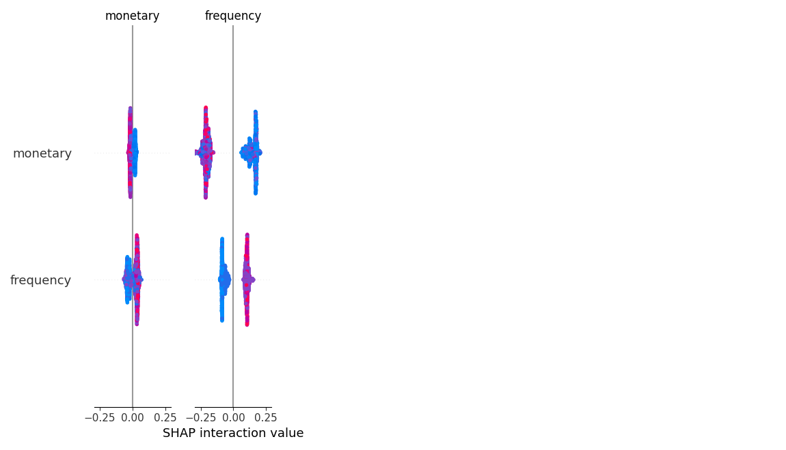

# Phase 6: Model Training & Evaluation Report

## 1. Detected ML Task Type
- **Task Type**: Classification

## 2. Model Leaderboard
| model               |   accuracy |   precision |   recall |   f1_score |   roc_auc |   training_time_sec |   inference_time_sec |
|:--------------------|-----------:|------------:|---------:|-----------:|----------:|--------------------:|---------------------:|
| Random Forest       |     0.8211 |      0.8251 |   0.8211 |     0.8226 |    0.8912 |           0.272333  |            0.108594  |
| Logistic Regression |     0.8042 |      0.8228 |   0.8042 |     0.8086 |    0.8905 |           0.0208926 |            0.0120382 |
| XGBoost             |     0.8157 |      0.8124 |   0.8157 |     0.8132 |    0.8837 |           1.88566   |            0.0352552 |
| LightGBM            |     0.8054 |      0.8162 |   0.8054 |     0.8086 |    0.8835 |           2.71539   |            0.037575  |
| Decision Tree       |     0.812  |      0.8218 |   0.812  |     0.815  |    0.8833 |           0.0250552 |            0.0121057 |

- **Best Model**: Random Forest
- **Fastest Inference**: Logistic Regression
- **Most Interpretable**: Logistic Regression

## 3. Feature Importance


## 4. Permutation Importance
| feature                 |   importance |         std |
|:------------------------|-------------:|------------:|
| tenure_days             |  0.101275    | 0.00673509  |
| frequency               |  0.0299277   | 0.00260695  |
| avg_days_between_orders |  0.0101297   | 0.00120121  |
| monetary                |  0.00114636  | 0.00058139  |
| category_diversity      |  0.000924767 | 0.000551877 |
| review_count            |  0.000635252 | 0.00066964  |
| late_delivery_rate      |  0.000119367 | 0.000277562 |
| payment_type_diversity  |  0           | 0           |
| avg_review_score        | -0.000150034 | 0.000222635 |
| avg_order_value         | -0.000348869 | 0.000805913 |

## 5. Error Analysis
Summary: {'Correct': 1364, 'False Positive (False Alarm)': 180, 'False Negative (Missed Churn)': 116}

## 6. Plain-English Explanation Example
```text
The model predicted 1 based on the overall data patterns.
```

## 7. SHAP Explanations

